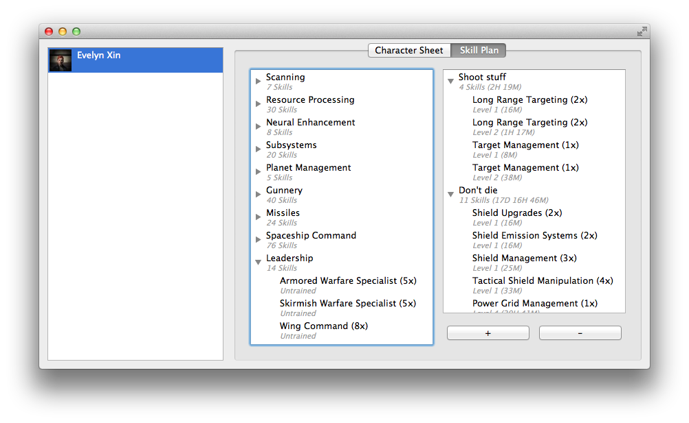

<h3>
<a name="eve-xin" class="anchor" href="#eve-xin"></a>Eve-Xin</h3>

Eve-Xin's a skill planner for Eve. This is what it looks like:

This is the character viewer, showing status and currently known skills

This is the skill planner, supporting multiple distinct plans for each character

